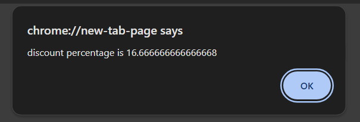

## 1.The value of numb1=?
##     let numb1=12
##     numb1/=3
## Ans:4

## 2.What does 'a' equal?
##   let a=17%4
## Ans:1

## 3.What does x++ equals?
##    let x=3
##     x++
## Ans:4

## 4.Create a Fareheit to Celcius converter
## C=((F-32)*5)/9

## Ans:let F=prompt("enter fareheit")
##      C=((F-32)*5)/9
##      alert("Fareheit to Celcius is "+C)

## 5.Create a discount percentage calculator
## discountpercentage=((MRP-sellingPrice)*100)/MRP

## Ans:let MRP=prompt("enter MRP")
##     let sellingPrice=prompt("enter the sellingPrice")
##     discountpercentage=((MRP-sellingPrice)*100)/MRP
##     alert("discount percentage is "+discountpercentage)

## 6.Create a BMI Calculator
## BMI=Weight(kg)/(height(m)*height(m))
## Ans:let Weight=prompt("enter weight")
##     let height=prompt("enter height")
##     BMI=Weight/(height*height)
##    alert("BMI is "+BMI)

